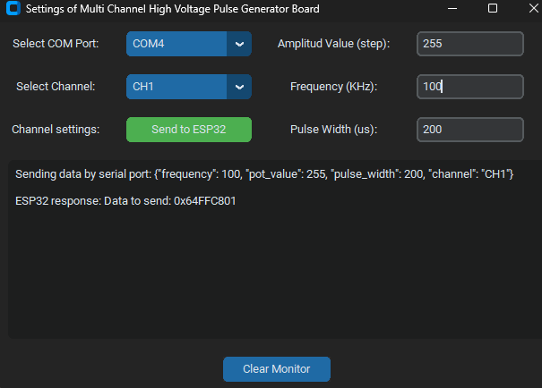

# Master ESP32

**SPI Communication with External Trigger and UART on ESP32**

This project involves using an ESP32 to send data over SPI when two conditions are met:

1. Data (frequency, pulse width, voltage amplitude, and channel) has been received over UART from user interface. 
2. An external trigger is detected on a specific pin. Simulating the optical detection of the droplet to be classified. 

Both conditions must be fulfilled before the data is packed into a 32-bit integer and sent to the slave device over SPI. You can download the **code [here](images/Master_Slave/Master_ESP32.ino)**

---

### 1.- SPI protocol: 

- Initialize SPI with mode 0, MSB first, and a clock speed of 1 MHz.

<pre style="margin: 0; font-family: monospace;">
<code style="color: #000000;">
vspi.setDataMode(SPI_MODE0); # The clock line is low when idle. Data is captured on the rising edge of the clock and updated on the falling edge.
vspi.setBitOrder(MSBFIRST); # "MSB First", the most significant bit (the highest bit) of the byte is transmitted first, followed by the less significant bits.
pinMode(VSPI_SS, OUTPUT); # Configuring SS as output
vspi.begin(VSPI_SCLK, VSPI_MISO, VSPI_MOSI, VSPI_SS); # Initialization
</code>
</pre>

- Data is sent in four bytes via SPI if **dataToSend** received from the user interface and **External trigger pin is HIGH**. 

<pre style="margin: 0; font-family: monospace;">
<code style="color: #000000;">
if (dataToSend != 0 && digitalRead(TRIGGER_PIN) == HIGH) {
  vspi.beginTransaction(SPISettings(spiClk, MSBFIRST, SPI_MODE0));
  digitalWrite(VSPI_SS, LOW);
  
  vspi.transfer((dataToSend >> 24) & 0xFF);  // Frequency
  vspi.transfer((dataToSend >> 16) & 0xFF);  // Pot_value
  vspi.transfer((dataToSend >> 8) & 0xFF);   // Pulse_width
  vspi.transfer(dataToSend & 0xFF);          // Channel
  
  digitalWrite(VSPI_SS, HIGH);
  vspi.endTransaction();
}
</code>
</pre>

### 2.- UART protocol: 

- Initialize serial communication considering the baud of the user interface for correct bilateral communication.

<pre style="margin: 0; font-family: monospace;">
<code style="color: #000000;">
Serial.begin(9600); // Initializes serial communication at 9600 baud
delay(1000); // Waits to stabilize the ESP32
</code>
</pre>

- Process Incoming UART Data: Read and parse incoming data as JSON, then pack the extracted values into a 32-bit integer.

<pre style="margin: 0; font-family: monospace;">
<code style="color: #000000;">
if (Serial.available()) {
  String input = Serial.readStringUntil('\n');
  DynamicJsonDocument doc(1024);
  deserializeJson(doc, input);
  
  int frequency = doc["frequency"];
  int pot_value = doc["pot_value"];
  int pulse_width = doc["pulse_width"];
  String channel_str = doc["channel"];
  
  uint8_t channel = (channel_str == "ALL") ? 0 : channel_str.substring(2).toInt();
  dataToSend = (frequency << 24) | (pot_value << 16) | (pulse_width << 8) | channel;
}
</code>
</pre>

- Confirmation of sending and receiving data via serial port.

