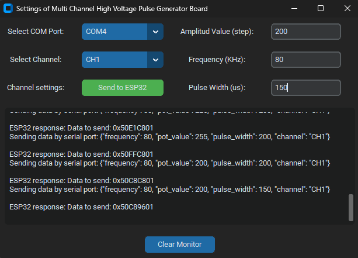
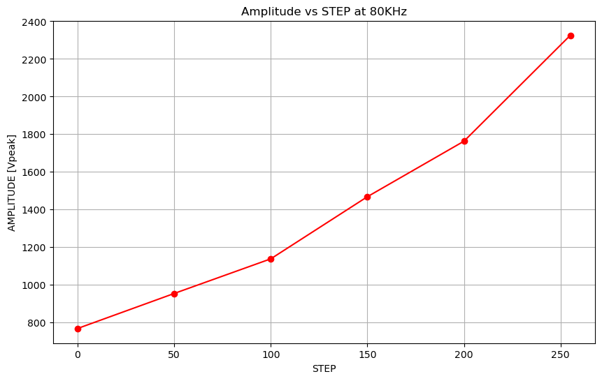
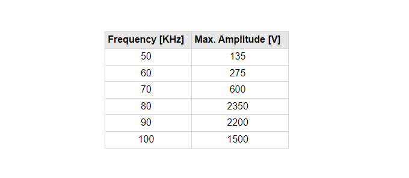
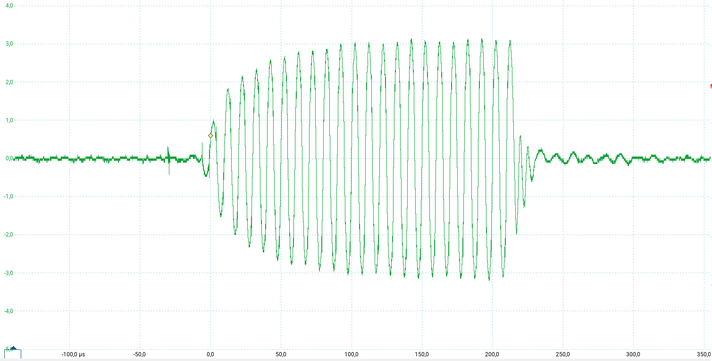
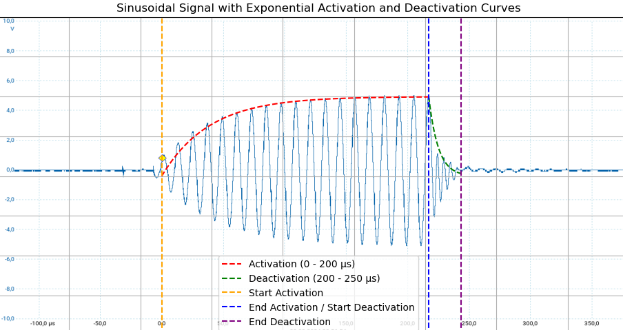

# Python code

Setup Instructions for Running the Program in Jupyter Lab. 

## 1. Installing Python

### Download Python
1. Go to the [official Python website](https://www.python.org/downloads/).
2. Select the latest version and download the appropriate installer for your operating system.

### Install Python
- **Windows**: Run the downloaded installer. Check the box **"Add Python to PATH"** before clicking **Install Now**.
- **macOS**: Run the downloaded `.pkg` file and follow the on-screen instructions.
- **Linux**: Open a terminal and run the following commands:
```bash
    sudo apt-get update
    sudo apt-get install python3 python3-pip
```

## 2. Verify Python and pip Installation
Open the terminal or command prompt and run:
```bash
 python --version
 pip --version
```

## 3. Install Jupyter Lab using pip

In the terminal or command prompt, run:
```bash
 pip install jupyterlab
```

## 4. Launch Jupyter Lab

Once installed, you can start Jupyter Lab with the following command:
```bash
 jupyter lab
```

## 5. Installing Required Libraries

Run the following commands in the terminal to install the required libraries for your program:
```bash
 pip install tkinter
 pip install customtkinter
 pip install pyserial
 pip install nbconvert
 pip install pyinstaller
```

## 6. Preparing the Code in Jupyter Lab

In Jupyter Lab, create a new notebook by selecting **Python 3** as the kernel. Then copy and paste the [**code**](app_interfaz/Interfaz_HVPG.ipynb). Press shift+enter and you could see the app like this:

[](images/interface.png)

If you prefer, you can convert the Notebook to a Python file and then create an executable file in the dist folder, using the following commands: 
```bash
 jupyter nbconvert --to python Interfaz_HVPG.ipynb
 pyinstaller --onefile Interfaz_HVPG.py
```

## 7. Using the Interface

**7.1 Selecting the COM Port**

 1. **Open the Interface**: Launch the graphical interface.
 2. **Select the COM Port**: 
    - In the interface, find the dropdown menu for available COM ports.
    - Click the dropdown and select the correct COM port that corresponds to your ESP32 device.
    - If the COM port is not listed, ensure the device is connected and refresh the list if the option is available.


>! **Caution** 
>!
>! Make sure the port is not in use, such as with the Arduino interface, if you are loading the program on the ESP32 master.


**7.2 Selecting the Channel**

1. **Locate the Channel Selection Menu**: In the interface, find the section labeled "Select Channel"
2. **Select a Channel**: Choose the specific channel you wish to configure or select "All" to apply settings to all channels **sequentially**.

**7.3 Adjusting Amplitude, Frequency, and Pulse Width**

1. **Amplitude Adjustment**: Enter the desired amplitude value in the corresponding input field. The step value corresponds to a peak voltage of the selected channel according to the following curves: 




>!! **Warning** 
>!!
>!! The amplitude value must be between **0 and 255**. If you define a value outside this range you will not be able to send the data. If you need operate a lower frequencies, you could modify the LC filter. Please check this section, [6. High Frequency Transformer](schematic2.md).

2. **Frequency Adjustment**: Enter the desired frequency value in the frequency input field. If you are using the inverter without an LC filter then it is recommended to operate in a range between **80-100KHz**. Because for frequencies between 50-77KHz the maximum voltage is significantly attenuated in addition to distorting the signal as you can see in the images below. In case you add an LC filter to the output of the inverter, then it works correctly at a frequency of 60 ± 5 KHz as shown previously. 




| [](images/70khz.png) | [](images/100khz.png) |
|:-------------------------------:|:--------------------------:|
| **Vpeak at 70KHz**            | **Vpeak at 100KHz**      |


>!! **Warning** 
>!!
>!! Frequency must be between **50 and 100 KHz** and with a step of 1 kHz. If you define a value outside this range you will not be able to send the data.


3. **Pulse Width Adjustment**: Enter the pulse width value in microseconds (µs) in the corresponding input field. Make sure the value is between 1 µs and 255 µs. 




>i **Note** 
>i
>i It is recommended to use a **pulse width greater than 100us** due to the activation time constant of each channel of the high voltage pulse generator. Consider that the deactivation time of each channel is approximately 30us.


**7.4 Applying and Sending the Settings**

1. **Apply Settings and send data**: Once you've adjusted the amplitude, frequency, and pulse width, press the "Send to ESP32" to send the data. 
2. **Monitor Feedback**: In the serial monitor, you should see feedback or confirmation that the data in 32 bits format was sent successfully. Something like this:

<div style="background-color: #f4f4f4; padding: 5px; border-radius: 1px; overflow-x: auto;">
  <pre style="margin: 0; color: #d63384;">
    <code>
      <span style="color: #228B22;">Sending data by serial port:</span> <span style="color: #000;">{"frequency": 100, "pot_value": 255, "pulse_width": 200, "channel": "CH1"}</span>
      <span style="color: #228B22;">ESP32 response:</span> <span style="color: #000;">Data to send: 0x64FFC801</span>
    </code>
</div>

>i **Note** 
>i
>i Ensure that the values are within the acceptable ranges; otherwise, an error message will be displayed.


